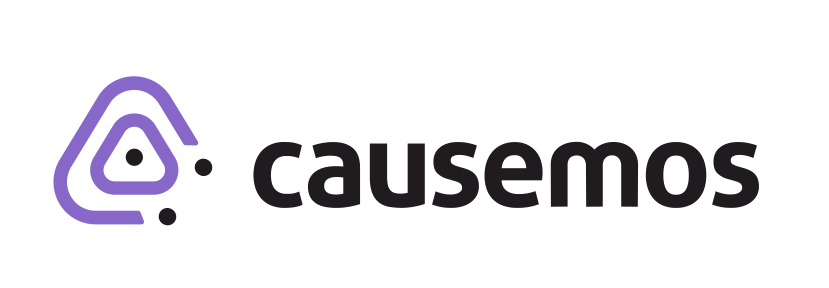

# Causemos

World Modelers application for exploring and building models!!

## Prerequisite

The following need to be installed

- NodeJS version 18
- Yarn 1.22+

## Auth Setup

### Setup Registry

Causemos requires multiple repos for development. Developers should clone [Causemos](https://gitlab.uncharted.software/WM/causemos),
[wm-playbooks](https://gitlab.uncharted.software/WM/wm-playbooks), and [wm-env](https://gitlab.uncharted.software/WM/wm-env).

Follow the steps outlined in the readme inside the
[wm-playbooks/kubernetes](https://gitlab.uncharted.software/WM/wm-playbooks/-/tree/main/kubernetes) directory. These
steps will allow kubernetes to pull images generated by the World Modellers repositories.

### Start Auth Services

Stand up the Causemos auth services by running the developer deployment script

```
dev_deploy.sh up
```

from within the [wm-playbooks/kubernetes](https://gitlab.uncharted.software/WM/wm-playbooks/-/tree/main/kubernetes) directory

## Developer Setup

### Install dependencies

```
yarn install
```

### Environment

You need an environment configuration file to run the application. Copy `server/template.env` to `server/.env` and fill in the variables.

If running against Uncharted internal openstack, you can find a working environment file here: https://gitlab.uncharted.software/WM/wm-env/-/tree/main/dev

### Debugging

The default development config includes some flags to facilitate debugging. Interested users would need to install the Chrome Debugger Extension (https://marketplace.visualstudio.com/items?itemName=msjsdiag.debugger-for-chrome) if it is not already installed!

### Additional dependencies

Causemos internally depends on an additional service: a data/tile service for handling data-intensive tasks. The service url is specified in the environment file. If you want to run the service locally, please follow the instructions in its respective repository.

- wm-go: https://gitlab.uncharted.software/WM/wm-go

### Running locally

```
# Start client - Defaults to localhost:8080
yarn start-client

# start server - Defaults to localhost:3000
yarn start-server

# start server in debug mode
yarn start-server-debug
```

Navigate your browser to:

```
localhost:8078
```

This shows developer information (i.e. usernames and passwords for the 2 allowed user types -- `adam = admin` and `ursula = user`)
application runs.

The application runs at:

```
localhost:8078/app
```

### Additional options

The application maintains several tasks that runs at regular intervals, these are turned off by default and must be opt-in at server start with the `--schedules` flag. The available options are

- dart: Synchronization process with DART
- aligner: Periodically request concept-aligner to refresh it's data

```
# example 1: both dart and aligner
yarn start-server --schedules dart,aligner


# example 2: only aligner and in debug mode
 yarn start-server-debug --schedules aligner
```

Features that require communication with Dojo are disabled by default and must be turned on manually.
Note that these will impact Dojo's production environment. These should only be enabled for careful testing to avoid creating discrepancies between Dojo and Causemos environments

- `dojo-sync`: Send datacube metadata changes to Dojo
- `allow-model-runs`: Submit model runs for execution

```
# example 3: allow model execution, don't sync updates
yarn start-server --allow-model-runs
```

## Building for Production

Building and packaging the code.

#### Build: Internal testing on Openstack

Deploy to internal Openstack for testing. Note you need to have your public-key added to the target machine.

```
# Default
./deploy_openstack.sh

# Use specific branch and port
PORT=4002 BRANCH="fix-123" ./deploy_openstack.sh
```

#### Build: Docker

You can build the docker image with the following steps. Here we assume you want to build a "local" version

```
# Build and pack client
yarn workspace client run build

# Install to server
cp -r client/dist server/public

# Build server
docker build -t docker.uncharted.software/worldmodeler/wm-server:local .
```

You can test docker images by

```
docker run -p 3000:3000 --env-file <envfile> -t docker.uncharted.software/worldmodeler/wm-server:<version>
```

Note docker interprets envfiles differently, the variables cannot be quoted!! So it is A=123 and not A="123"

## Release and Deployment

#### Release new docker image (In Progress !!!)

Docker images can be release to Uncharted registry at http://10.65.4.8:8081/#browse/welcome

To push to the registry, make sure you have logged in

```
docker login -u <confluence-username> --password <confluence-password> https://docker.uncharted.software
```

#### Release new configuration

For configuration and stack changes, for example adding new variables to the envfile or adding a new sevice, the following procedures apply.

We keep the "prod" docker-compose file in a separate repo: https://gitlab.uncharted.software/WM/wm-playbooks/-/tree/main/causemos

We keep the "prod" environment files in a separate repo: https://gitlab.uncharted.software/WM/wm-env

Once you have changed these files, contact `cloud-ops` to ask them to redeploy these configurations.

### Swarm Testng (In Progress !!!)

```
# Start
docker swarm init
docker stack deploy --compose-file docker-compose-dev.yml world_modeler

### Check status/info
docker ps
'OR'
docker stack ps world_modeler

### To end
docker stack rm world_modeler
```
